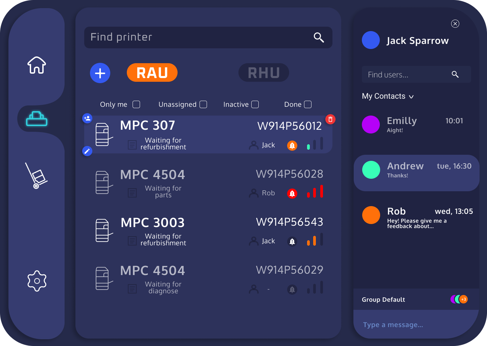
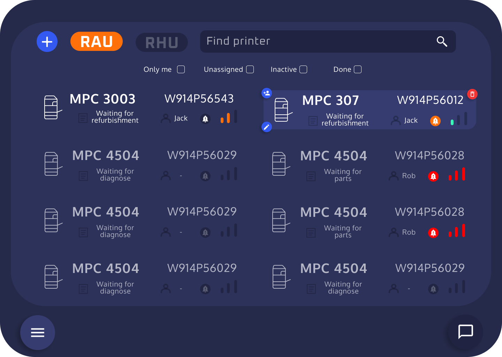
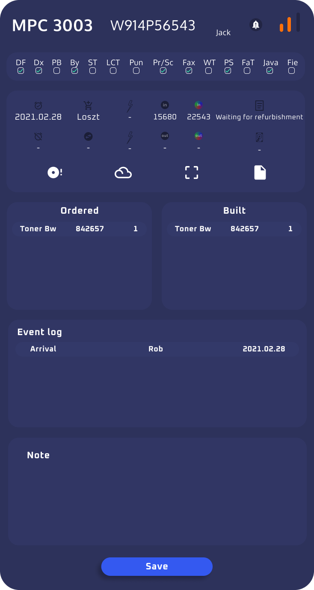
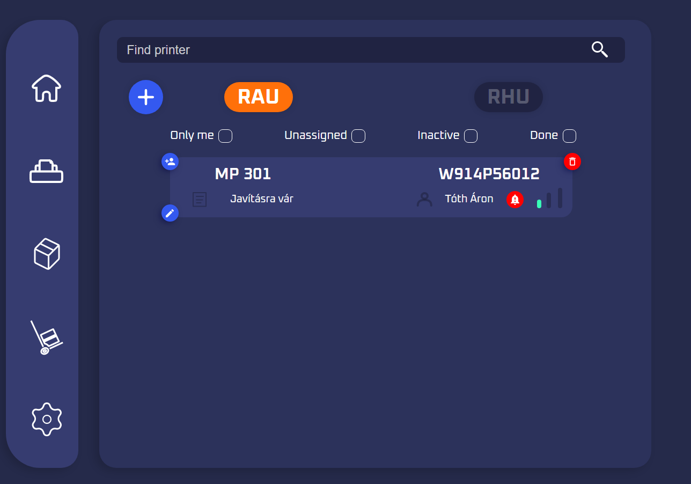
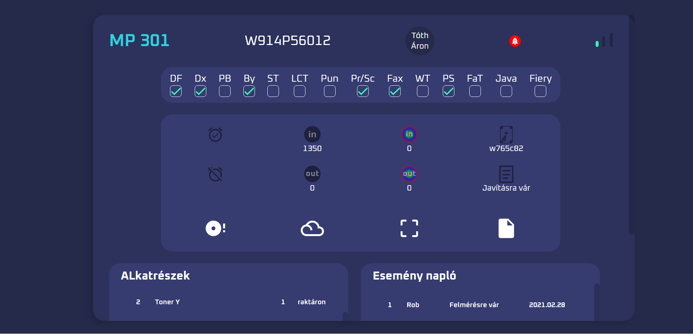
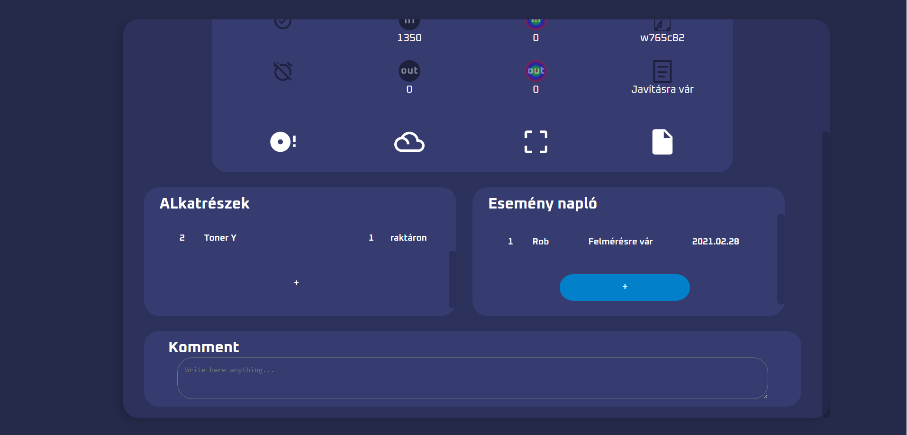
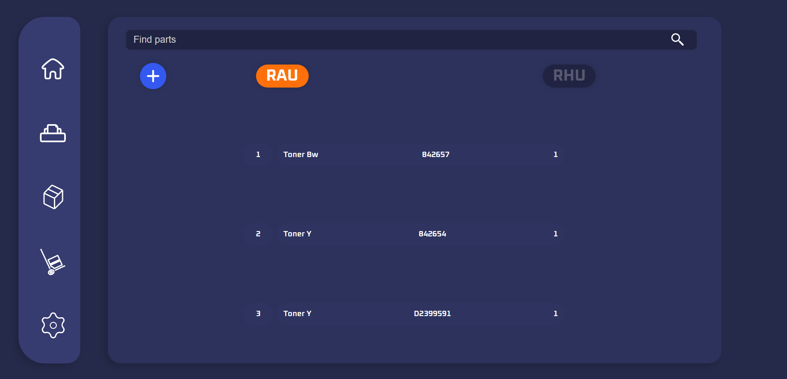
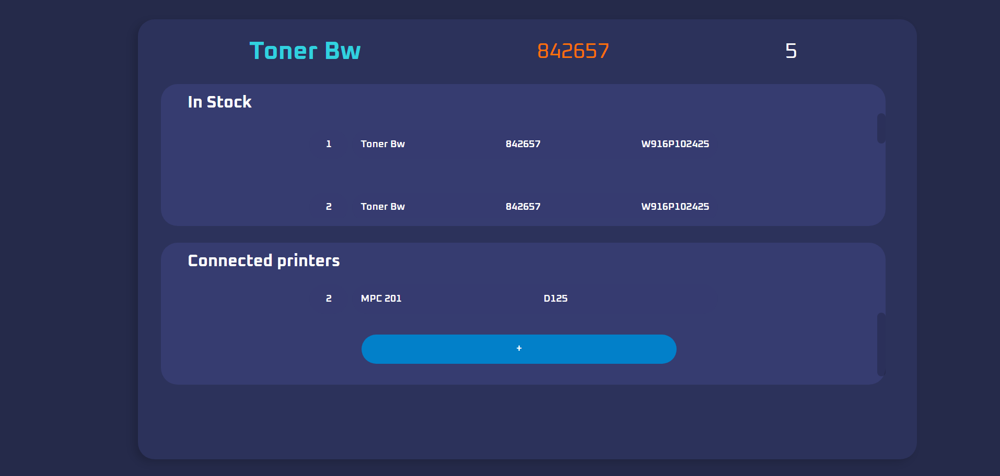

## 🔧 Ricoh Szervíz Applikáció - RSA 🔧

### Futtatás: `docker compose up -d` vagy grafikus interfészben indítás

### Teszt: [Próbáld ki](https://rsa.artonwork.com)

(Egyedi dizájn könyvtárak nélkül.)

**A használathoz először kérlek olvasd végig a dokumentációt!!**

Ez egy konténerizált alkalmazás **lemez** formátumban (későbbiekben **image / DB Image**).

A konténerizáció lényege, hogy bármilyen operációs rendszeren úgyanúgy fog futni az alkalmazás a **Docker** segítségével. Tehát az **image** futtatásához mindössze csak egyetlen alkalmazást kell majd telepíteni méghozzá a **Docker-t**.

Az alkalmazás 3 alalkalmazásból áll:

> - **Adatbázis**
> - **Szerver**
> - **Kliens**

Az **adatbázis** értelemszerűen tárolja az adatokat.
A **szerver** köti össze az **adatbázist** a **klienssel**, egy API-val (Application Programming Interface). Az API dolga, hogy autentikálja a felhasználót, bizonyos adatokat titkosítson és kiszolgálja a klienst adatokkal, illetve az adatbázist a frissített információkkal.
A **Kliens** jelenik meg a felhasználó számára.

Az alkalmazás megfelelő használata érdekében, **mind a három image-nek futnia kell**, ehez a további **dokumentációk** segítenek, akár csak az ellenörzésükben.

Mind a három alkalmazás **automatizált** és **konténerizált**, tehát bármilyen rendszeren könnyedén futtatható.

A futtatáshoz szükséges programok:

> - **Docker docker-compose**
> - **Mongo: shell, tools**
> - **bash terminál**
> - **git**

A **bash** egy UNIX terminál tehát Mac OS-en és Linux-on alapértelmezett, viszont Windowson nem. Windowson a cmder használható. A **cmder-hez** a **mongo -shell-t és tools-t** külön külön le lehet tölteni tömörített fájlban amit kicsomagolás után a bin mappából a cmder bin mappájába kell helyezni. Ezek .exe fájlok lesznek. Fontos, hogy a **mongosh.exe-t** át kell nevezni **mongo.exe-re**. A **git** előtelepített a **cmder-en** belül, de külön is lehet telepíteni. Az alkalmazás manuális frissítését teszi lehetővé, mivel egy verzió kezelő szoftverről beszélünk.

## Linkek

#### Windows:

> - [**Docker**](https://docs.docker.com/desktop/windows/install/)
> - [**docker-compose**](https://docs.docker.com/compose/install/)
> - [**Mongo Shell**](https://downloads.mongodb.com/compass/mongosh-1.1.1-win32-x64.zip)
> - [**Mongo Tools**](https://fastdl.mongodb.org/tools/db/mongodb-database-tools-windows-x86_64-100.5.1.zip)
> - [**Bash Terminál (cmder.zip)**](https://github.com/cmderdev/cmder/releases)
> - [**git**](https://git-scm.com/book/en/v2/Getting-Started-Installing-Git)

### Linux / Ubuntu:

> - [**Docker**](https://docs.docker.com/engine/install/ubuntu/)
> - [**docker-compose**](https://docs.docker.com/compose/install/)
> - [**Mongo Shell**](https://downloads.mongodb.com/compass/mongodb-mongosh_1.1.1_amd64.deb)
> - [**Mongo Tools**](https://fastdl.mongodb.org/tools/db/mongodb-database-tools-ubuntu2004-arm64-100.5.1.deb)
> - [**git**](https://git-scm.com/book/en/v2/Getting-Started-Installing-Git)

### Mac OS:

> - [**Docker**](https://docs.docker.com/desktop/mac/install/)
> - [**docker-compose**](https://docs.docker.com/compose/install/)
> - [**Mongo Shell**](https://downloads.mongodb.com/compass/mongosh-1.1.1-darwin-x64.zip)
> - [**Mongo Tools**](https://fastdl.mongodb.org/tools/db/mongodb-database-tools-macos-x86_64-100.5.1.zip)
> - [**git**](https://git-scm.com/book/en/v2/Getting-Started-Installing-Git)

### Egyéb OS-hez:

> - [**Docker**](https://docs.docker.com/engine/install/)
> - [**docker-compose**](https://docs.docker.com/compose/install/)
> - [**Mongo Shell**](https://www.mongodb.com/try/download/shell)
> - [**Mongo Tools**](https://www.mongodb.com/try/download/database-tools)
> - [**git**](https://git-scm.com/book/en/v2/Getting-Started-Installing-Git)

### Adatbázis grafikus interfész:

> - [**Mongo GUI**](https://www.mongodb.com/try/download/community)

## Az alkalmazások, nem nyíltforráskóduak nyilvánosságuk bemutatás célját szolgálják!

### Kliens kinézet:

